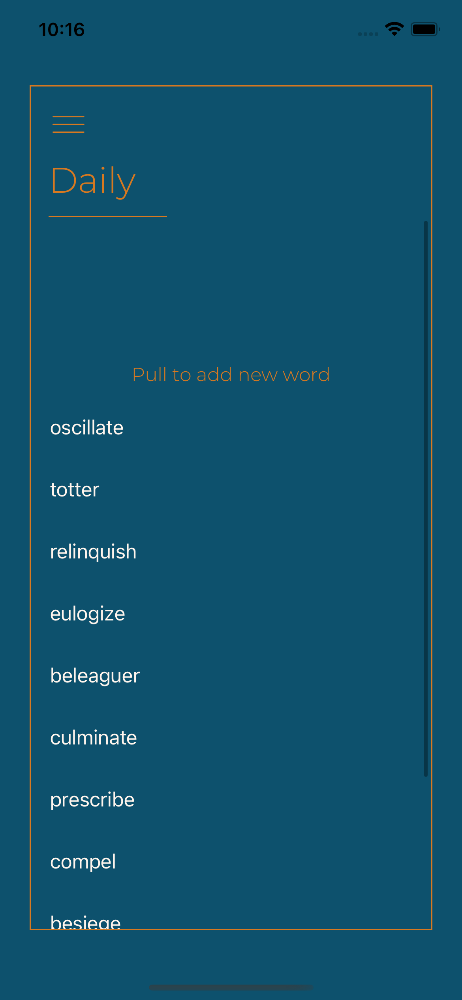
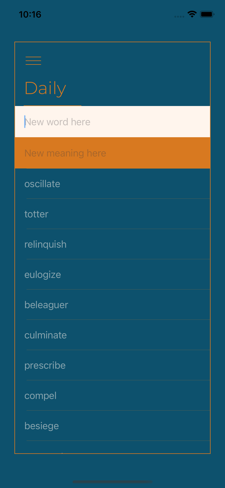
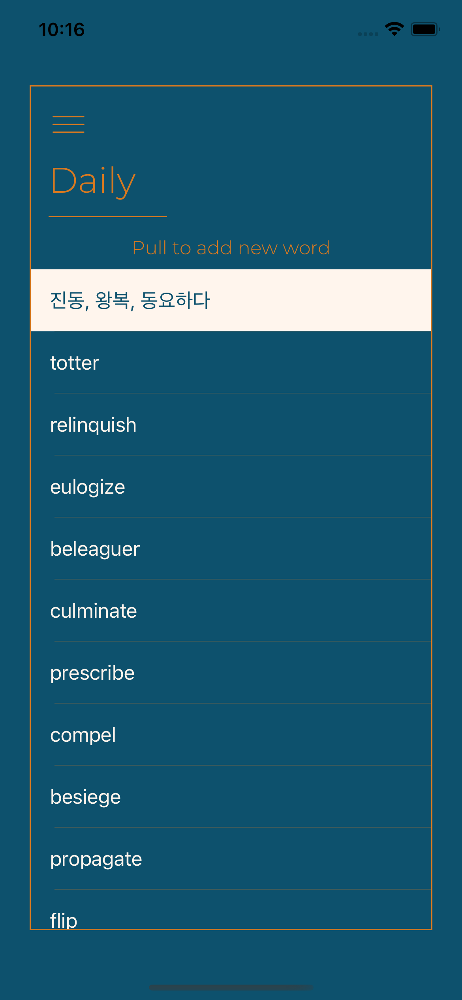
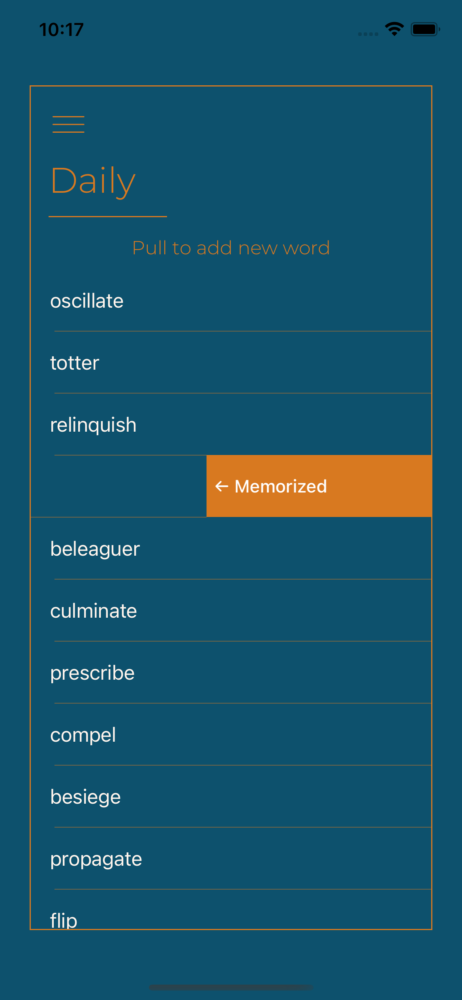

# flip_it

### 단어 암기를 뒤집다

filp-it은 군더더기 없는 단어암기장입니다.  
손쉽게 단어를 추가하고 원할 때 꺼내어 외워보세요.

#### 프로젝트 기간 : 2022. 2. 7. ~ 2022. 2. 28.
#### 앱스토어 링크 : https://apps.apple.com/kr/app/flip-it/id1611117727?l=kr
 

## 기능

### 리스트를 당겨 단어를 추가할 수 있습니다.

### 단어를 누르면 단어의 뜻을 볼 수 있습니다.

### 외운 단어는 스와이프로 지울 수 있습니다.
